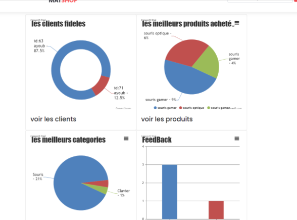

# MAT-SHOP
MAT SHOP is dynamic web site made mainly with PHP following the MVC model where users can login, sign up and browse products using a variety of filters and select the
desired product.
users can as well add products to cart and view their details, we also added an admin dashboard where if autheniticated the admin can add products and view the sales
also see all the percentages related to a certain category or clients.

## Installation

### to run this project you need to have the following requirements:
- PHP 7 or newer
- XAMPP web server
- Visual Studio Code IDE

## Run

```
// open XAMPP Server and Run Apache and MySQL server then go to your localhost
```

## Screen Shots
### Regular User


### Admin User




### you can clone and run the project and see full working website

## Contributing
Pull requests are welcome. For major changes, please open an issue first to discuss what you would like to change.

Please make sure to update tests as appropriate.

## License
[MIT](https://choosealicense.com/licenses/mit/)
